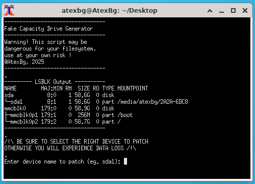
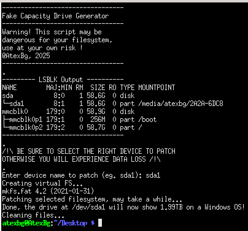

# Fake Capacity Drive Patcher

### ⚠️ DISCLAIMER ⚠️
### This script can corrupt you filesystem(s), please use it with a safe environnement (on a RPi for example) and be sure to backup your data if needed, also this can be used as a scam, even if the real capactiy come back after formatting the drive, so, be careful !

>Note : This program won't work on WSL.

## Usage

- First you have to make the file executable : `chmod +x fake_cap.sh`
- Plug your USB drive into the computer/device
- Execute the script `sudo ./fake_cap.sh`
- (you need to use the root account for the script to work)

Then wait until everything is finished, the drive will be unmounted automatically.

>Note: This will create a temporary file at `/tmp/2tb_temp` to store the virtual filesystem which is around ~524MB, it will be deleted after the script execution (so be sure to have enough storage space)

Then plug your drive into any Windows computer and it will show a 1.99TB drive regardless of the actual size of it
You can still use it until you reach the real capacity of the NAND chip inside, but it's better to reformat it after.

Linux kernels won't be tricked by that, they will show the real capacity of the device (unless it have a modified MCU), untested on Mac.

## TODO
- Add option to choose drive size
- Add support for NTFS/exFAT drives
- Add ability to make >2TB fake Capacity
- Improve script security
